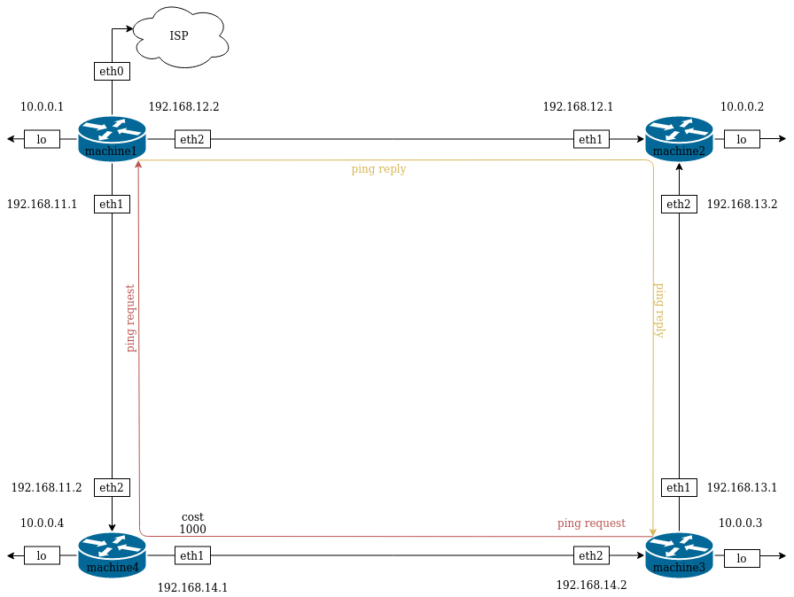

Проект подготовлен так, что увеличив Vagrantfile переменную N добавятся VM, к ним добавятся links, а сетевая связность останется и схема останется рабочей.

Для того, чтобы получить практические навыки работы с динамической маршрутизацией, утилитами ip, traceroute, tracepath и развёртыванием простого однозонного OSPF предлагается следующее: 

1. Развернуть 3 виртуальных машины;
2. Объединить эти виртуальные машины разными виртуальными каналами;
3. Настроить OSPFv2 между виртуальными машинами на базе quagga;
4. Настроить асимметричную маршрутизацию;
5. Восстановить симметричную маршрутизацию не уменьшая цену интерфейса из п.4.

В целях получения двух равновесных маршрутов до Loopback интерфейса через хоуп я добавил еще одну VM.
### схема

Таблица соответствия каналов и адресов.  
| Канал | Адресация |
|-------|-----------|
| ISP   | DHCP client |
| link1 | 192.168.11.0/24 |
| link2 | 192.168.12.0/24 |
| link3 | 192.168.13.0/24 |
| link4 | 192.168.14.0/24 |

Таблица адресов на интерфейсах устройств.  
| Устройство | Интерфейс | Адрес |
|------------|-----------|-------|
| machine1 | lo2 | 10.0.0.1/32 | 
| machine1 | eth0 | vagrant DHCP | 
| machine1 | eth1 | 192.168.11.1/24 |
| machine1 | eth2 | 192.168.12.2/24 | 
| machine2 | lo2 | 10.0.0.2/32 | 
| machine2 | eth0 | vagrant DHCP | 
| machine2 | eth1 | 192.168.12.1/24 |
| machine2 | eth2 | 192.168.13.2/24 | 
| machine3 | lo2 | 10.0.0.3/32 | 
| machine3 | eth0 | vagrant DHCP | 
| machine3 | eth1 | 192.168.13.1/24 |
| machine3 | eth2 | 192.168.14.2/24 |
| machine4 | lo2 | 10.0.0.4/32 | 
| machine4 | eth0 | vagrant DHCP | 
| machine4 | eth1 | 192.168.14.1/24 |
| machine4 | eth2 | 192.168.11.2/24 |